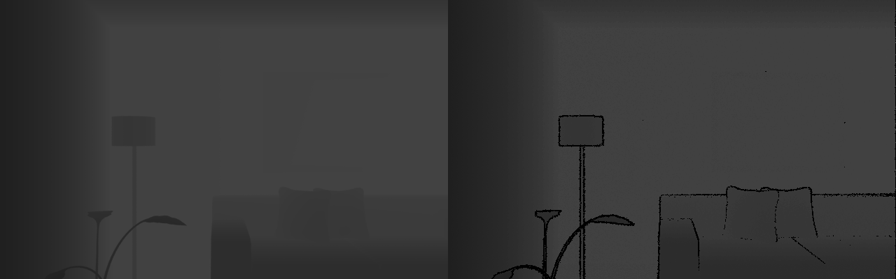

# Realistic RGB-D Sensor Noise Simulator

This is an OpenCV package for simulating RGB-D sensor such as Kinect or Xtion sesor noise as described in the following paper:


*A Benchmark for RGB-D Visual Odometry , 3D Reconstruction and SLAM.*
Ankur Handa, Thomas Whelan, John McDonald, Andrew J. Davison 
In ICRA, 2014

# Dependency

* OpenCV 3.0
* Boost
* Eigen
* Sophus
* CUDA

# How to compile

Make sure you have all dependency installed correctly. 

```
$ git clone ...
$ cd rgbd_simulation
$ mkdir build
$ cd build
$ cmake ..
$ make 
```

# How to get started

* Download the noise free RGB-D data from [ICL dataset](https://www.doc.ic.ac.uk/~ahanda/VaFRIC/iclnuim.html).
* Extract the file into a folder. (tar -xvf living.tar.gz).  
* Edit line 159 - 160 to specify the input and output folder.
* compile again and excute the code.

```
$ make
$ ./ICL
```

# Example of simulated depth noise

<br><br><br><br><br><br><br><br><br><br>

The left is the original depth map and right is depth map with simulated kinect noise added.